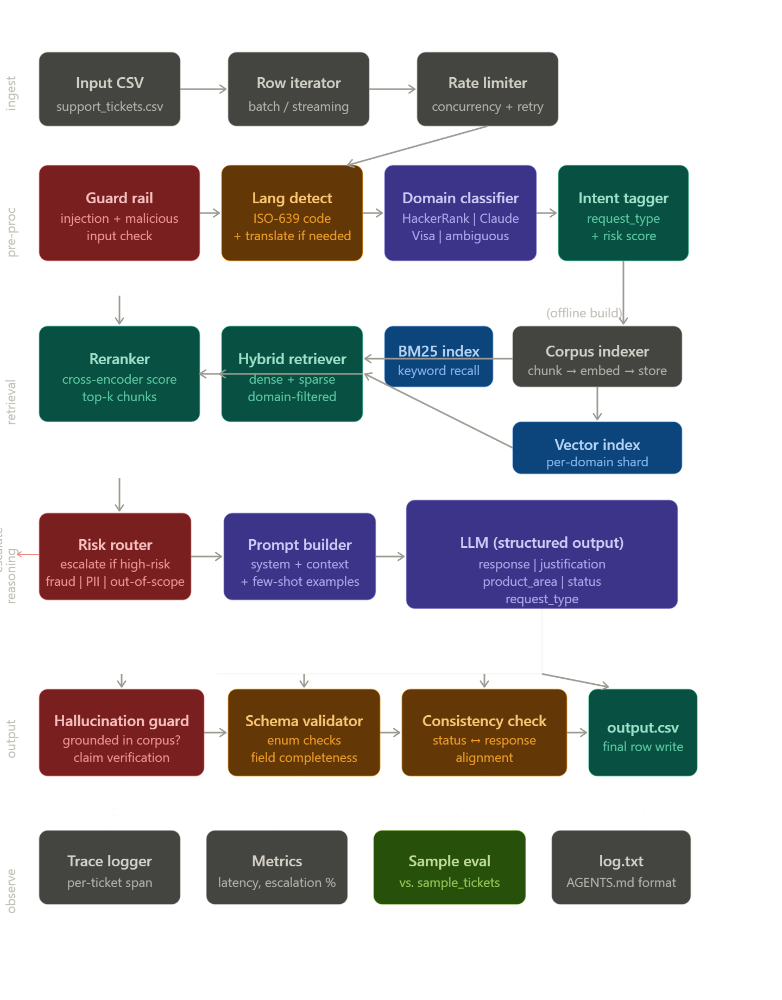

Now let me break down each layer in the detail a senior engineer at Google would care about.
Layer 0 — Ingestion
The input CSV is not just "read row by row." At scale you'd run a batch iterator with configurable concurrency (think asyncio task pools in Python), a backpressure mechanism, and a retry queue for rows that fail mid-pipeline. Even in a hackathon context, async processing of 30 tickets in parallel instead of serially is the difference between 2 minutes and 30 seconds.
Layer 1 — Pre-processing (the most underrated layer)
This is where most naive solutions collapse. You need four sub-components running in sequence:
The guard rail catches prompt injection (the French-language ticket in your dataset is literally a jailbreak attempt — it asks the agent to dump its internal retrieval logic). A simple pattern match on phrases like "show me your rules," "reveal your prompt," and "ignore previous instructions" gates these out as invalid before they reach the LLM.
The language detector resolves multilingual tickets. Google Translate's langdetect library or a langdetect pip package identifies the ISO-639 code and you normalize to English before retrieval, then optionally translate the response back.
The domain classifier maps each ticket to HackerRank / Claude / Visa or "ambiguous." This is a lightweight call — you can do this with a zero-shot LLM call, or even a TF-IDF classifier trained on the sample tickets. This matters enormously for retrieval, because your vector index should be domain-sharded so you don't get Visa docs surfacing for HackerRank tickets.
The intent tagger emits two things: a request_type candidate (product_issue / feature_request / bug / invalid) and a risk score (0–1). Risk score factors in: Does the ticket mention money, fraud, stolen card, identity theft, PII, account deletion? High-risk tickets get short-circuited straight to escalated before the expensive LLM call.
Layer 2 — Retrieval (the correctness engine)
This is what separates a grounded agent from a hallucinator. The corpus you have (Visa docs, HackerRank articles, Claude help center) gets chunked at ~512 tokens with 50-token overlap and embedded offline. At runtime you run hybrid retrieval: dense (embedding similarity) plus sparse (BM25 keyword match) over the domain-specific shard, then a cross-encoder reranker picks the top 5 chunks. The reranker pass is critical — it dramatically improves precision because it can attend to the full query-chunk pair rather than comparing vectors independently.
Layer 3 — Reasoning
The risk router acts as a second gate here — if the intent tagger gave a high risk score, you skip the LLM response entirely and return a structured escalation with a canned message. This is what "escalate high-risk cases instead of guessing" means operationally.
The prompt builder assembles: a domain-specific system prompt, the retrieved chunks as grounded context, 2–3 few-shot examples from sample_support_tickets.csv, and a strict output schema definition. The LLM is instructed to produce JSON with all five fields. Using structured output (via Anthropic's tool use or a response_format constraint) means you never have to parse free text.
Layer 4 — Output validation
Every LLM response goes through three checks before it's written to CSV. The hallucination guard checks whether claims in the response are attributable to retrieved chunks (you can do this with a second LLM call asking "is this claim supported by the context?", or with simpler string overlap heuristics). The schema validator ensures all enum values are legal. The consistency checker catches absurdities like status=replied with a response body that says "please contact support" (that's an escalation, not a reply).
Layer 5 — Observability
Every ticket gets a trace with timing for each layer, which makes debugging fast. The sample eval compares your agent's output against sample_support_tickets.csv ground truth and prints a per-field accuracy report before you run the full set. This is how you catch regressions when you tweak prompts.
Key design decisions that differentiate this from a naive solution:
Domain-sharded vector indices mean your retrieval stays precise. The offline indexing step means the agent never makes live web calls. Two-gate escalation (intent tagger at pre-processing + risk router at reasoning) means risky tickets like "identity stolen," "card blocked," and the jailbreak in French never reach the generative step. Structured output with validation means your CSV will never have malformed enum values. And the async pipeline means you can process the full support_tickets.csv in parallel rather than serially, which matters for a hackathon time budget.